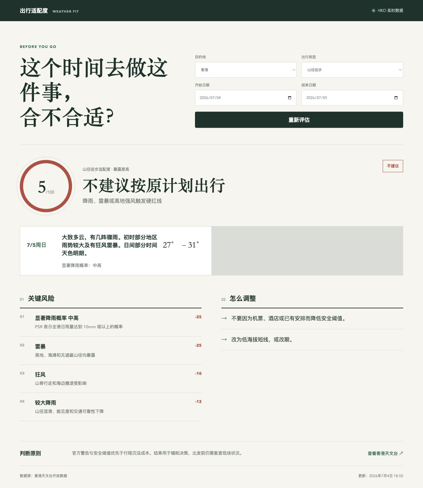
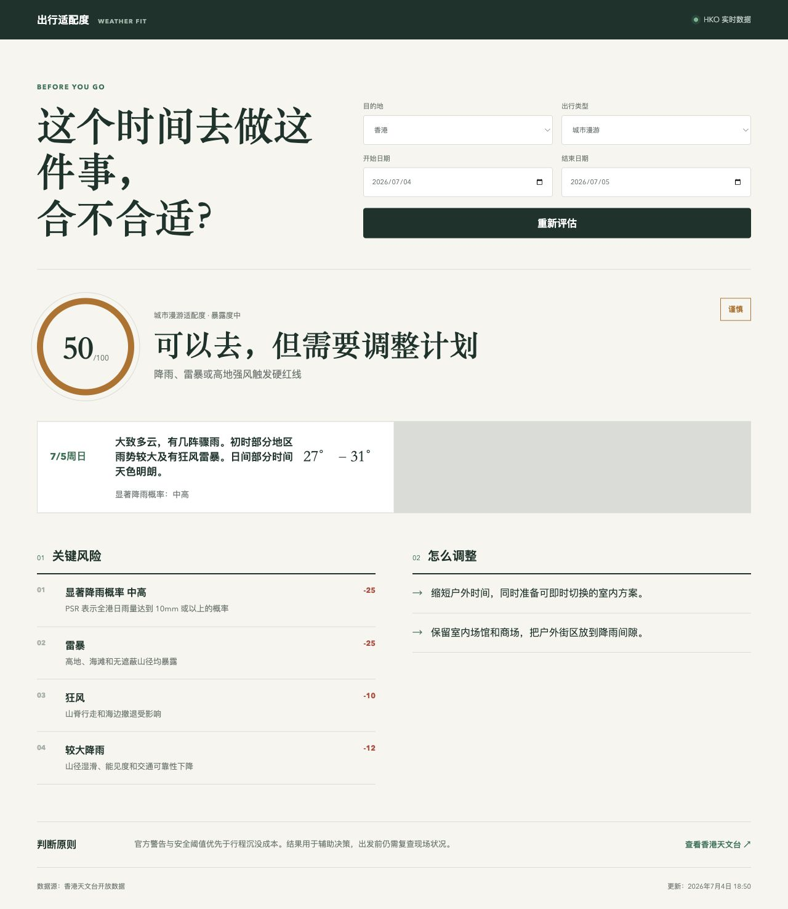

# 出行适配度 / Travel Weather Fit

一个聚焦出发前天气决策的轻量网站。

它只回答一个问题：**这个时间去做这件事，合不合适？**

当前版本使用香港天文台 Open Data，根据目的地、日期和出行活动的暴露度，输出适合、谨慎或不建议，并解释关键风险和调整方式。





## 为什么需要活动暴露度

同一场雨，对不同活动并不意味着同一种风险：

- 山径徒步会暴露在雷暴、强风、湿滑和撤退困难中。
- 露营与海滩活动对风雨的暴露度更高。
- 城市漫游可以缩短户外时间并切换室内方案。
- 美食探店通常只需要调整交通、排队和步行安排。

因此工具不会只问“天气好不好”，而会继续问“你准备做什么”。

## 核心流程

1. 选择目的地、日期和出行类型。
2. 读取香港天文台九日预报、警告和特别天气提示。
3. 将天气风险与活动暴露度组合成适配度。
4. 输出适合、谨慎或不建议，并说明风险与调整方式。
5. 日期超出可靠预报范围时不生成分数，只给出复查时点。

## 当前支持

- 目的地：香港。
- 活动：山径徒步、露营过夜、城市漫游、美食探店、海滩活动。
- 数据源：香港天文台九日预报、天气警告和特别天气提示。
- 运行方式：纯静态 HTML、CSS 和 JavaScript，无构建依赖。

## 运行

```bash
python3 -m http.server 8080
```

然后访问 `http://localhost:8080/`。

## 项目结构

```text
index.html                  页面结构与输入控件
styles.css                 响应式视觉样式
app.js                     活动暴露度、结果分类与渲染
adapters/hko-weather.js    HKO 数据读取和可解释风险信号
assets/                    README 与文章截图
```

## 判断边界

- 官方警告和硬性安全阈值优先于行程沉没成本。
- 分数用于组织信息，不是官方安全指数。
- 九日预报没有覆盖所选日期时，工具拒绝输出虚假精确结果。
- 出发前仍需复查现场封路、交通、同行者状态和最新官方通知。

## 隐私与安全

- 仓库不包含姓名、联系方式、预订信息、个人地址或账号凭证。
- 仅调用香港天文台公开接口，不需要 API key。
- 公开版本不包含原始行程 Case、出发城市、预算、住宿和航班安排。

## 相关内容

- 方法文章：[我如何用 AI，为一次出行搭一套决策系统](https://wildfires.cc/blog/ai-travel-decision-system/)
- 数据文档：[Hong Kong Observatory Open Data API](https://data.weather.gov.hk/weatherAPI/doc/HKO_Open_Data_API_Documentation.pdf)

## License

MIT
