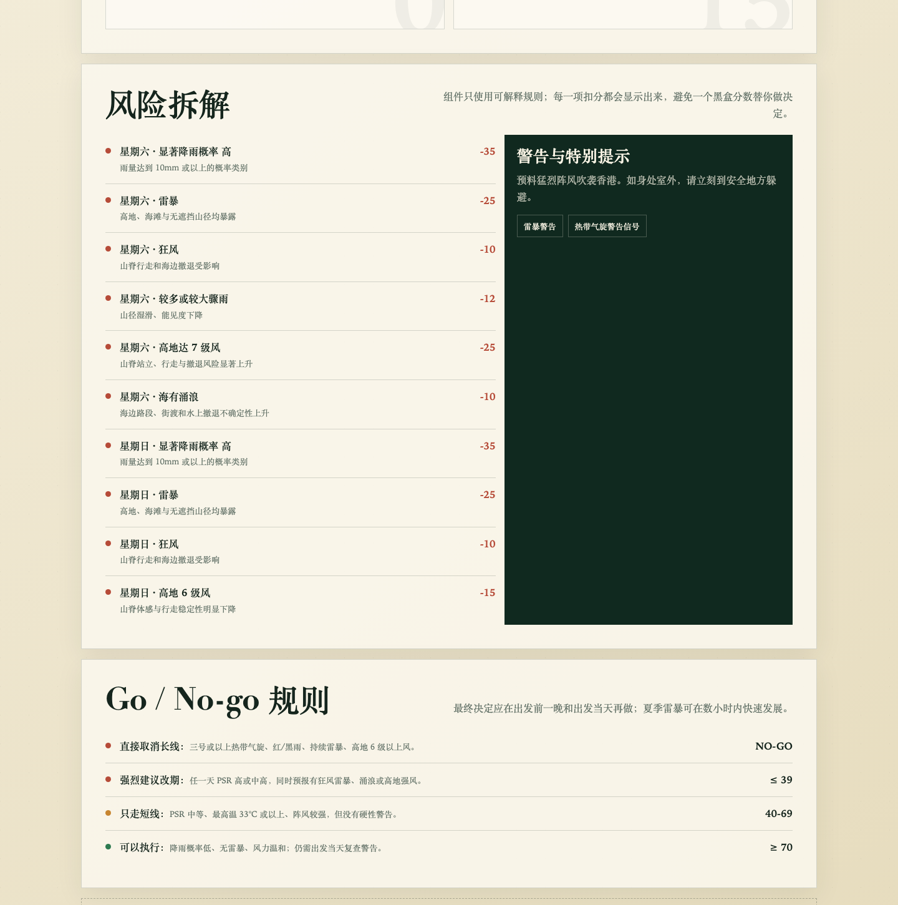

# AI Travel Decision System

一个用公开天气数据辅助户外出行决策的单页示例。

它不负责生成更多景点，而是把天气、风险阈值、备选路线和决策时点连成一套可执行机制。当前示例使用香港天文台 Open Data，评估下一个周末是否适合执行麦理浩径二至三段徒步计划。




## 它解决什么

- 自动读取未来九日天气、警告和特别天气提示。
- 将雷暴、强风、较大降雨、涌浪和酷热转为可解释的风险项。
- 基于事先定义的规则给出 Go / Caution / No-go 判断。
- 实时接口不可用时显示离线快照，并明确标注数据状态。
- 展示风险拆解与决策规则，而不只给一个无法解释的分数。

## 方法框架

一套可复用的 AI 出行决策机制可以拆成五层：

1. **目标与约束**：时间、预算、体力、风险边界和体验目标。
2. **信息分层**：路线与规则属于稳定层；天气、交通和现场状态属于动态层。
3. **风险阈值**：在产生沉没成本前定义缩短、改期和取消条件。
4. **备选方案**：为条件良好、部分恶化和关键条件失效准备 Plan A / B / C。
5. **决策时点**：在预订前、出发前一周、前一天、当天和行程途中重新判断。

这个仓库展示的是动态信息、风险阈值和结果解释部分。真实出行仍需要结合个人约束、官方通知、现场封路和同行者状态做最终决定。

## 运行

项目没有构建依赖，直接用静态服务器打开即可：

```bash
python3 -m http.server 8080
```

然后访问 `http://localhost:8080/`。

直接双击 `index.html` 也能显示离线快照，但部分浏览器会限制跨域读取实时 API。

## 改成自己的出行系统

在 `index.html` 中调整以下部分：

- 页面标题、路线名称和风险说明。
- `scoreDay()` 中的风险信号、权重和硬性红线。
- `decide()` 中的 Go / Caution / No-go 规则。
- `getNextWeekend()`，或者替换为自己的目标日期逻辑。
- `FALLBACK` 离线快照和数据源说明。

更换地区时，应优先使用当地政府或权威机构的开放数据，并在页面中显示来源和更新时间。

## 隐私与安全

- 仓库不包含姓名、联系方式、预订信息、个人地址或账号凭证。
- 仅调用香港天文台公开接口，不需要 API key。
- 示例分数不是专业安全建议，不能替代官方警告、领队判断或个人风险评估。

## 相关内容

- 在线示例：[weather.wildfires.cc](https://weather.wildfires.cc/)
- 方法文章：[我如何用 AI，为一次出行搭一套决策系统](https://wildfires.cc/blog/ai-travel-decision-system/)
- 数据文档：[Hong Kong Observatory Open Data API](https://data.weather.gov.hk/weatherAPI/doc/HKO_Open_Data_API_Documentation.pdf)

## License

MIT
